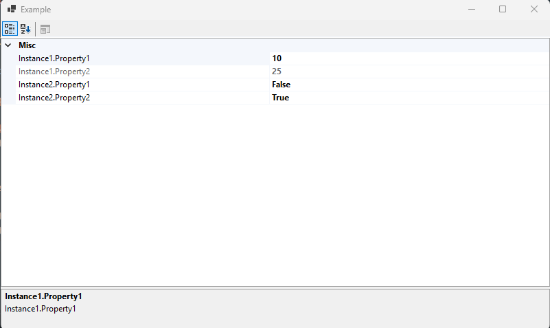

# dynamic-object
A dynamically buildable object with custom PropertyDescriptor for use with the WinForms PropertyGrid.

## TODO
- Add attribute for tagging properties.
- Use reflection to handle automatic building of CustomObject.

## Example



```C#
using Usignert.DynamicObject;

namespace Example
{
    class Class1
    {
        public int Property1 { get; set; } = 10;
        public int Property2 { get; set; } = 25;
    }

    class Class2
    {
        public bool Property1 { get; set; } = false;
        public bool Property2 { get; set; } = true;
    }

    public partial class Form1 : Form
    {
        public Form1()
        {
            InitializeComponent();

            var propertyGrid1 = new PropertyGrid
            {
                Dock = DockStyle.Fill,
                Text = "Property Grid"
            };

            Controls.Add(propertyGrid1);

            var instance1 = new Class1();
            var instance2 = new Class2();

            var obj = new CustomObject
            {
                new CustomProperty("Instance1.Property1", "Instance1.Property1", instance1.Property1),
                new CustomProperty("Instance1.Property2", "Instance1.Property2", instance1.Property2),
                new CustomProperty("Instance2.Property1", "Instance2.Property1", instance2.Property1),
                new CustomProperty("Instance2.Property2", "Instance2.Property2", instance2.Property2)
            };

            propertyGrid1.SelectedObject = obj;
        }
    }
}
```